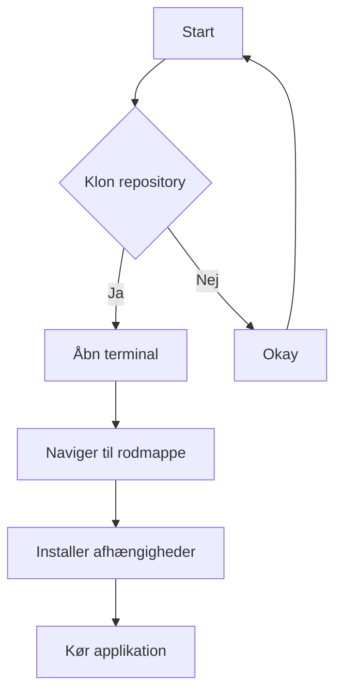

# Projektbeskrivelse

Dette projekt er udviklet af Marius, Phillip og Malthe og omhandler udviklingen af en GUI-applikation til simulering af højttalerrespons baseret på brugerdefinerede parametre.

## Formål

Formålet med dette projekt er at udvikle et brugervenligt værktøj, der kan simulere og visualisere højttalerrespons ved hjælp af en basreflekskabinet. Ved at justere forskellige parametre som kabinetdimensioner, højttalerparametre og frekvensområde kan brugeren få indsigt i, hvordan forskellige faktorer påvirker højttalerens ydeevne.

## Funktioner

- Simulering af højttalerrespons baseret på brugerindtastede parametre.
- Justering af kabinetdimensioner, højttalerparametre og frekvensområde.
- Visualisering af responsen i et grafisk interface.

## Installation

1. Klon dette repository til din EDB behandler
2. Åbn terminalen og naviger til projektets rodmappe.
3. Installer de nødvendige afhængigheder ved at køre `pip install -r requirements.txt`.
4. Kør GUI-applikationen ved at køre `python gui_main.py`.

## Brugsvejledning

1. Åbn GUI-applikationen ved at køre `python gui_main.py`.
2. Indtast de ønskede parametre i inputfelterne.
3. Juster slideren for kabinetvolumen for at ændre højttalerresponsen.
4. Tryk på "Submit" for at opdatere simuleringen og visualiseringen.

## Mermaid-diagram

# Bidragydere
- Marius
- Phillip
- Malthe
